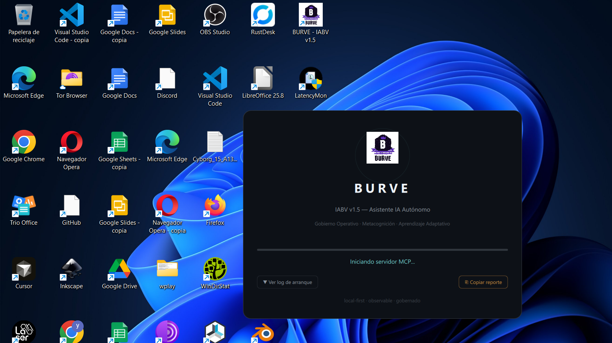
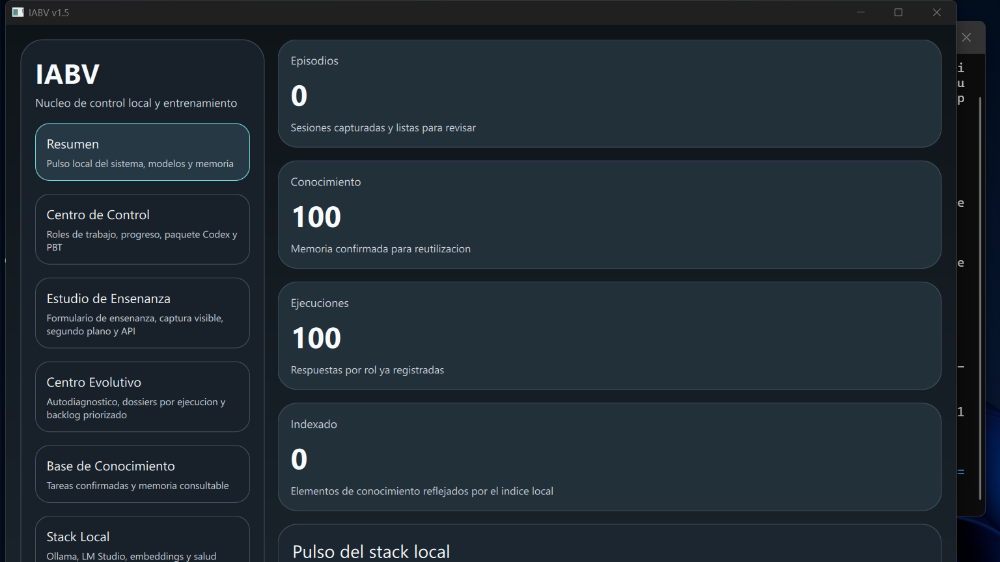

# Handoff De Auditoria Live - 2026-04-28

## Objetivo de esta fase

Dejar evidencia durable de lo que ya se corrigio, de lo que se comprobo en runtime con la UI visible y de lo que sigue roto para que otra IA no reinicie el trabajo desde cero.

Este documento resume la auditoria real ejecutada sobre la laptop del usuario, no solo pruebas aisladas.

Contrato complementario para cualquier IA que continue esta linea:

- `docs/rfcs/unified_audit_evolution_contract.md`

Ese RFC deja explicito que auditoria, aprendizaje, startup telemetry y simbiosis multi-IA deben converger en la arquitectura metacognitiva existente, no en carriles paralelos.

## Fuente de verdad usada

Prioridad aplicada en esta auditoria:

1. UI visible y comportamiento live del proceso `pythonw.exe`
2. `WorldModelSnapshot`, `PortableContext`, `SelfExamination`
3. logs y listeners reales (`127.0.0.1:8000`, `127.0.0.1:18921`)
4. contratos del codigo fuente
5. pruebas focalizadas

## Lo que ya quedo resuelto

### 1. Auditorias standalone mas limpias y utiles

- `scripts/run_self_audit.py` y `scripts/ui_engine_audit.py` ya no arrastran side effects pesados del runtime normal.
- El bootstrap de auditoria entra en `IABV_AUDIT_MODE=1`, salta autoinstalls no esenciales y hace teardown explicito.

### 1.5. Metacognicion cloud mas conectada al aprovisionamiento real

- La metacognicion ya detecta `no functional provider` y `single provider dependency`.
- El auto-provision ya recibe `missing_env_keys` reales en vez de una llamada vacia.
- `bootstrap` ya deja `auto_correction_engine` realmente cableado para ese loop.
- Esto no cierra todavia el selector soberano unificado, pero evita que otra IA repita el trabajo de wiring basico.

### 2. Bug real de wiring en startup evolution

- Se corrigio el uso de `workspace_dir` por `workspace_root` en `bootstrap.py`.
- El autostart del MCP ya no hereda `pythonw.exe`; bajo UI visible ahora usa `python.exe` cuando corresponde.

### 3. Consolas visibles de helpers

- MCP y `cloudflared` ya se lanzan ocultos en Windows.
- Sus salidas se redirigen a logs del workspace:
  - `data/logs/mcp_server_runtime.log`
  - `data/logs/cloudflared_runtime.log`
- Los `pip install` automaticos tambien se ejecutan sin abrir terminal visible.

### 4. Reintentos pesados ciegos

- `aider_coder` ahora tiene cooldown persistido para no reintentar instalacion pesada en cada arranque.
- El estado de cooldown queda en `data/evolution/auto_install_cooldowns.json`.

### 5. Chat humano ligero que no deberia congelar la UI

- Salud, preguntas de `world_model`, autoexaminacion y preguntas simples ya no deberian entrar al camino pesado de `infer_task`.
- Se agrego una ruta local ligera para `hola`, preguntas de capacidad y preguntas sobre pantalla/navegadores.

### 6. Carga inicial de UI menos agresiva

- Se difirieron refreshes iniciales en varios ViewModels:
  - `ControlCenterViewModel`
  - `CaptureStudioViewModel`
  - `EvolutionCenterViewModel`
  - `CentroVivoViewModel`
  - `KnowledgeBaseViewModel`
  - `ProviderSettingsViewModel`
  - `RunHistoryViewModel`
- `Main.qml` ahora difiere tambien el montaje del shell principal, no solo la pagina interna.

### 7. Bridge mas fiel al estado real del chat

- `ui_bridge_service.py` ya lee mensajes vivos del `ControlCenterViewModel` cuando esta disponible.
- `send_message` ya no finge que el mensaje fue procesado por completo; devuelve estado de cola cuando corresponde.

### 8. Backlog visible para otras IAs

- `data/evolution/backlog.json` ya se usa como rastro persistente de pendientes estrategicos.
- `PortableContextService` ya fue extendido previamente para proyectar backlog manual/estrategico al contexto portable.

## Pruebas que ya pasaron

- `tests/test_control_center_viewmodel.py -k "greeting or browser_question or bridge_message_routes_into_chat or lightweight_packet" -q`
- `tests/test_general_chat_llm_routing.py -q`
- `tests/test_startup_evolution.py -q`
- `tests/test_ui_bridge_service.py -q`
- `tests/test_ui_smoke.py -q`

## Evidencia live confirmada

### Hallazgo 1. Antes habia helpers visibles contaminando la experiencia

En corridas anteriores la UI se mezclaba con ventanas visibles de `python.exe` y `cloudflared`. Ese incumplimiento de "una sola ventana" ya quedo corregido en las corridas buenas posteriores.

### Hallazgo 2. Se reprodujo un freeze duro por chat

Antes del recorte del camino pesado, un simple `hola` por bridge podia disparar el proceso visible a ~8.4 GB y dejar el bridge colgado. Ese caso ya no deberia recorrer el mismo camino.

### Hallazgo 3. El problema principal restante no es MCP ni tunnel

Se verifico que en varias corridas:

- `127.0.0.1:8000` quedaba escuchando
- el bridge podia quedar vivo
- pero la UI seguia congelada en splash o no entraba a estado interactivo real

Eso desplaza el foco del problema a la transicion de startup y al readiness real del shell principal.

## Capturas curadas de referencia

Estas capturas se versionan para que otra IA pueda ver evidencia visual minima del estado live:

- Splash estancado en una corrida larga: 
- Estado live tras diferir startup evolution, aun sin shell interactivo estable: 
- Freeze posterior al chat pesado previo al recorte: 

## Problemas que siguen abiertos

### P0. Splash -> shell principal sigue roto

El splash se sigue quedando entre 20% y 60% en distintas corridas. A veces ya con MCP y bridge vivos, a veces aun antes del bridge. El problema es inconsistente pero real.

### P0. Falta handshake de readiness real entre UI y bridge

Cuando el bridge ya esta arriba, un `send_message` puede quedar encolado si el shell principal todavia no esta materializado o no esta procesando el flujo de chat.

### P1. Sigue habiendo demasiado trabajo en el camino critico de arranque

Aunque ya se difirieron varias cosas, todavia hay costo temprano por scans, tool availability y rutas de instalacion/verificacion.

### P1. Memoria de arranque alta

Despues de los fixes el arranque live sigue alto, en el orden de ~2.1-3.7 GB. El caso extremo de ~8.4 GB se asocio al camino de chat pesado, pero la huella base sigue siendo excesiva.

### P1. Selector soberano unificado aun no existe

La metacognicion ya deduce mejor las APIs gratis faltantes, pero aun no existe el mercado unificado:

- APIs gratis/trial
- sesiones web gobernadas
- local shadow learning

### P1. Rotacion multi-cuenta/cuota gratis aun no existe

Sigue faltando una politica real para reutilizar sesiones y cambiar de cuenta o ruta cuando una cuota gratis se agota, sin inventar credenciales ni saltarse auth humana inevitable.

### P1. Supervision soberana de MCP + tunnel

MCP y `cloudflared` ya arrancan mejor, pero falta heartbeat, restart controlado y estado visible en UI. Esto es especialmente importante si Devin depende del tunnel.

### P2. Export de auditoria a nube desde la propia UI

La evidencia aun depende de trabajo de ingenieria manual. Hace falta un flujo de seleccion/redaccion/export para que el propio programa publique su estado de auditoria de forma gobernada.

## Orden de ataque recomendado

1. Resolver `shell readiness` y la transicion `splash -> main window`.
2. Quitar del camino critico `_log_tool_availability()` y autoinstalls/verificaciones no esenciales.
3. Medir memoria/tiempos de arranque por tramos concretos.
4. Revalidar chat live visible con el bridge despues del fix de readiness.
5. Solo despues subir al selector soberano `API gratis + web session + local shadow`.
6. Agregar supervision y restart de MCP/tunnel.
7. Cerrar el flujo de export/commit/push de auditoria desde la propia UI.

## Archivos funcionales tocados en esta fase

- `src/iabv_v15/bootstrap.py`
- `src/iabv_v15/services/auto_correction_engine.py`
- `src/iabv_v15/services/ui_bridge_service.py`
- `src/iabv_v15/ui/qml/Main.qml`
- `src/iabv_v15/ui/qt.py`
- `src/iabv_v15/ui/viewmodels/control_center_viewmodel.py`
- `src/iabv_v15/ui/viewmodels/capture_studio_viewmodel.py`
- `src/iabv_v15/ui/viewmodels/evolution_center_viewmodel.py`
- `src/iabv_v15/ui/viewmodels/centro_vivo_viewmodel.py`
- `src/iabv_v15/ui/viewmodels/knowledge_base_viewmodel.py`
- `src/iabv_v15/ui/viewmodels/provider_settings_viewmodel.py`
- `src/iabv_v15/ui/viewmodels/run_history_viewmodel.py`
- `tests/test_control_center_viewmodel.py`
- `tests/test_general_chat_llm_routing.py`
- `tests/test_startup_evolution.py`
- `tests/test_ui_bridge_service.py`
- `tests/test_ui_smoke.py`

## UNRESOLVED

- No afirmar que el shell esta completamente listo mientras el splash siga dominando la ventana visible.
- No tratar `bridge listening` como sinonimo de `UI interactiva`.
- No mezclar historial stale con observacion viva si se contradicen.
- No reabrir consolas visibles de helpers; el principio de una sola ventana sigue vigente.
